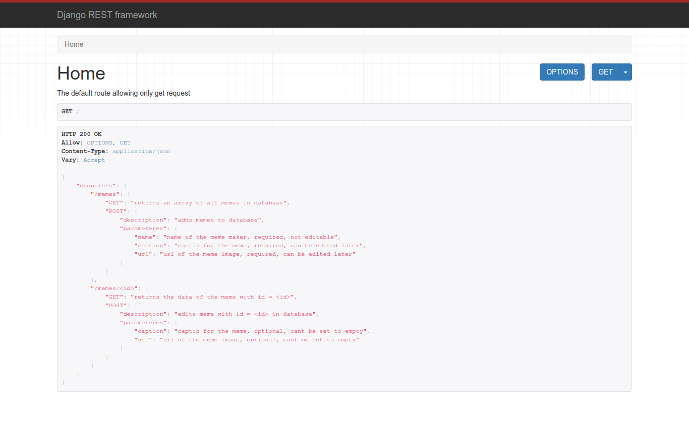
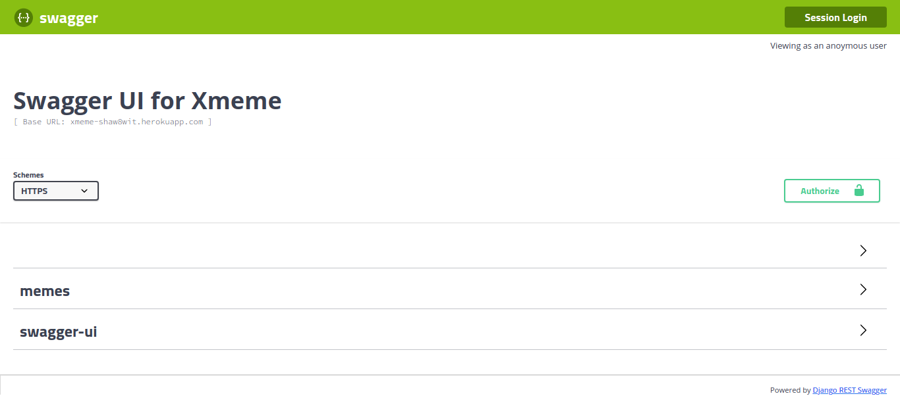

# meme-stream-backend

&nbsp;
&nbsp;
&nbsp;

The back-end repo for the meme-stream project, a place for memers to share and appreciate memes together.

+ 

    
<b>Built using:</b>

    <ul>
        <li>Django</li>
        <li>Django Rest Framework</li>
        <li>Django Rest Swagger</li>
        <li>Markdown</li>
        <li>SQLite DB</li>
    </ul>

+ 

    
<b>Deployed using:</b>

    <ul>
        <li>Heroku</li>
        <li>Gunicorn</li>
        <li>Whitenoise</li>
    </ul>

+ 

    
<b>Backend Links:</b>

    <ul>
        <li>
            <a href="https://xmeme-shaw8wit.herokuapp.com/">Details</a>
        </li>
        <li>
            <a href="https://xmeme-shaw8wit.herokuapp.com/swagger-ui/">Swagger UI</a>
        </li>
    </ul>

+ 

    
<b>Screenshots:</b>

    <ul>
        <li>
            

                
Django

                
            

        </li>
        <li>
            

                
Swagger UI

                
            

        </li>
    </ul>

